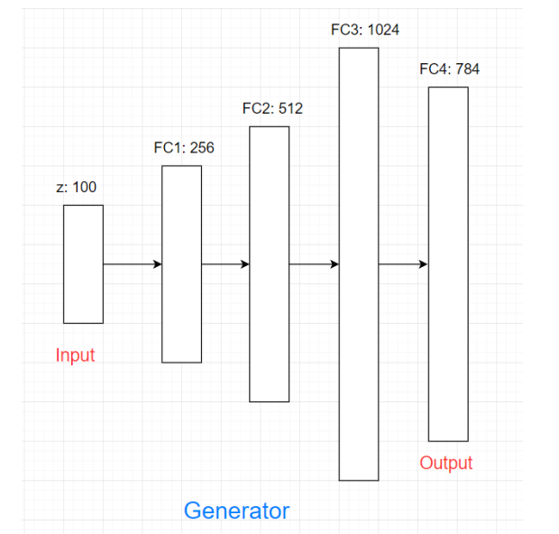

[StyleGAN](https://github.com/NVlabs/stylegan)

## Một số ứng dụng của GANs
Có thể ứng dụng GANs để làm ứng dụng 
- Faceswap được, 
- phục hồi ảnh cũ, 
- sinh khuôn mặt từ người nổi tiếng, 
- tạo anime characters, 
- sinh ảnh tự nhiên [BigGAN](https://arxiv.org/abs/1809.11096), 
- image to image translation (pix2pix): input là ảnh phúc thảo, output là ảnh màu đầy đủ. Đây là bài toán supervised nghĩa là có cặp ảnh input và output
- image to image translation (unsupervised) [CycleGAN](https://github.com/junyanz/CycleGAN): ví dụ bài toán chuyển ngựa thành ngựa vằn...
- super resolution: GANs có thể giúp tăng độ phân giải từ thấp lên cao
- Text to image [StackGAN](https://github.com/hanzhanggit/StackGAN): chuyển một câu thành ảnh
- Generate human pose: với ảnh người đứng và dáng đứng mới có thể sinh ra người với dáng đứng mới [Pose Guided Person Image Generation](https://arxiv.org/abs/1705.09368)
- Music generation [MidiNet](https://arxiv.org/pdf/1703.10847.pdf)

## GAN 
GAN thuộc generative model - model có khả năng sinh ra dữ liệu mới.

GAN - Generative adversarial network. Có tên này do GAN được hình thành từ 2 mạng Generator và Discriminator.

## Cấu trúc GANs

Trong GAN, Generator sinh ra các dữ liệu mới giống như thật còn Discriminator thì cố gắng phân biệt đâu là dữ liệu có thật và đâu là dữ liệu được sinh ra từ Generator.

Ví dụ: bài toán dùng GAN để sinh ra tiền giả mà có thể dùng được. Dữ liệu có là tiền thật. Generator giống như người làm tiền giả còn Discriminator giống như cảnh sát. Người làm tiền giả cố gắng làm ra tiền giả mà cảnh sát cũng không phân biệt được. Nhiệm vụ của cảnh sát là phân biệt đâu là tiền giả, tiền thật. Mục tiêu của người làm tiền giả là làm ra tiền giả mà cảnh sát không phân biệt được với tiền thật.

Trong quá trình train GAN cảnh sát (discriminator) có 2 việc cần làm:
- Học cách phân biệt tiền nào là thật tiền nào là giả
- Nói cho thằng làm tiền giả (generator) biết là tiền nó làm ra vẫn chưa qua mắt được và cần cải thiện hơn.

Dần đần thằng làm tiền giả sẽ làm tiền giả giống với tiền thật hơn và cảnh sát cũng thành thạo trong việc phân biệt tiền giả và tiền thật. Mong đợi tiền giả từ GAN sẽ đánh lừa được cảnh sát.

**Bài toán**: dùng mạng GAN sinh ra chữ số viết tay giống với bộ dữ liệu MNIST

**Generator**

Generator là mạng sinh ra dữ liệu, tức sinh ra các chữ số giống với dữ liệu trong MNIST dataset. Generator có input là noise (random vector) và output là chữ số.

Tại sao input là noise? Vì các chữ số viết ra không hoàn toàn giống nhau. Do đó khi thay đổi noise ngẫu nhiên thì Generator có thể sinh ra một dạng khác của chữ số viết tay (vẫn là chữ số đó). Noise cho generator thường được sinh ra từ normal distribution hay uniform distribution.


Input của Generator là noise vector có chiều 100. Sau đấy NN được áp dụng với số units trong các hiđen layer lần lượt là 256, 512, 1024.



Nhận thấy output layer có số chiều là 784 (vì ảnh trong MNIST là ảnh xám có kích thước 28x28 - tổng cộng 784 pixels). Sau cùng chúng ta cần reshape lại.

```python
# Mô hình Generator
g = Sequential()
g.add(Dense(256, input_dim=z_dim, activation=LeakyReLU(alpha=0.2)))
g.add(Dense(512, activation=LeakyReLU(alpha=0.2)))
g.add(Dense(1024, activation=LeakyReLU(alpha=0.2)))
# Vì dữ liệu ảnh MNIST đã chuẩn hóa về [0, 1] nên hàm G khi sinh ảnh ra cũng cần sinh ra ảnh có pixel value trong khoảng [0, 1] => hàm sigmoid được chọn
g.add(Dense(784, activation='sigmoid'))  
g.compile(loss='binary_crossentropy', optimizer=adam, metrics=['accuracy'])
```

**Discriminator**

Discriminator là mạng để phân biệt xem dữ liệu là thật (dữ liệu từ dataset) hay giả (dữ liệu sinh ra từ Generator). Trong bài toán này discriminator dùng để phân biệt chữ số từ bộ MNIST và dữ liệu sinh ra từ Generator. Discriminator có input là ảnh biểu diễn 784 chiều, output là ảnh thật hay ảnh giả.


Đây là bài toán binary classification. Input của Discriminator là ảnh có kích thước 784 chiều. Sau đó đi qua một số hidden layer với số units lần lượt là 1024, 512, 256. Mô hình này đối xứng với Generator. Output layer chỉ có 1 unit thể hiện xác suất ảnh input là ảnh thật, ở đây hàm sigmoid được sử dụng.

```python
# Mô hình Discriminator
d = Sequential()
d.add(Dense(1024, input_dim=784, activation=LeakyReLU(alpha=0.2)))
d.add(Dropout(0.3))
d.add(Dense(512, activation=LeakyReLU(alpha=0.2)))
d.add(Dropout(0.3))
d.add(Dense(256, activation=LeakyReLU(alpha=0.2)))
d.add(Dropout(0.3))
# Hàm sigmoid cho bài toán binary classification 
d.add(Dense(1, activation='sigmoid'))
```

**Loss function**

Kí hiệu `z` là noise đầu vào của generator, x là dữ liệu thật từ bộ dataset. Kí hiệu Generator là `G`, Discriminator là `D`. G(z) là ảnh được sinh ra từ Generator. D(x) là giá trị dự đoán của Discriminator xem ảnh x là thật hay không, D(G(z)) là giá trị dự đoán xem ảnh sinh ta từ Generator là ảnh thật hay không. 

Vì chúng ta có 2 mạng Generator và Discriminator với mục tiêu khác nhau nên chúng ta cần 2 loss functions cho mỗi mạng. Discriminator cố gắng phân biệt đâu là ảnh thật, đâu là ảnh giả. Đây là bài toán binary classification nên loss function dùng là binary cross-entropy.

```python
d.compile(loss='binary_crossentropy', optimizer=adam, metrics=['accuracy'])
```

Giá trị output của model đi qua hàm sigmoid nên sẽ nằm trong khoảng (0, 1) nên Discriminator sẽ được train để inout ảnh ở dataset thì output gần 1 còn input ảnh sinh ra từ Generator thì output gần 0 hay D(x)=>1 và D(G(z))=>0.


Hay nói cách khác loss function muốn max D(x) và min D(G(z)). Việc min D(G(z)) tương đương với việc max 1 - D(G(z)). Do đó loss function của Discriminator trong paper được viết là:


*Discriminator loss*

E là kì vọng , hiểu đơn giản là lấy trung bình của tất cả các dữ liệu.

Generator sẽ học để đánh lừa Discriminator rằng số nó sinh ra là giống số thật hay D(G(z))=>1. Hay loss function của Generator muốn max D(G(z)) tương đương với min 1 - D(G(z)).


*Generator loss*

Ta có thể viết gộp lại loss của mô hình GAN như sau:


Từ hàm loss của GAN có thể thấy việc train Generator và Discriminator đối nghịch nhau, trong khi D cố gắng max loss V thì G cố gắng min V (V(G) là loss của generator). Quá trình train GAN kết thúc khi model GAN đạt đến trạng thái cân bằng của 2 models gọi là Nash equilibrium. 

## Code


